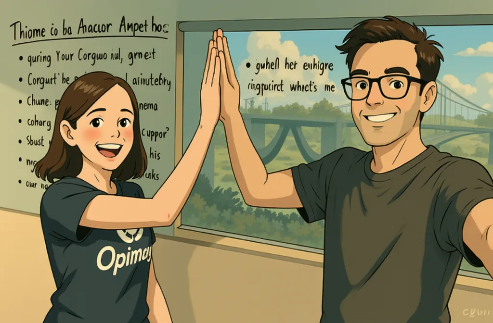
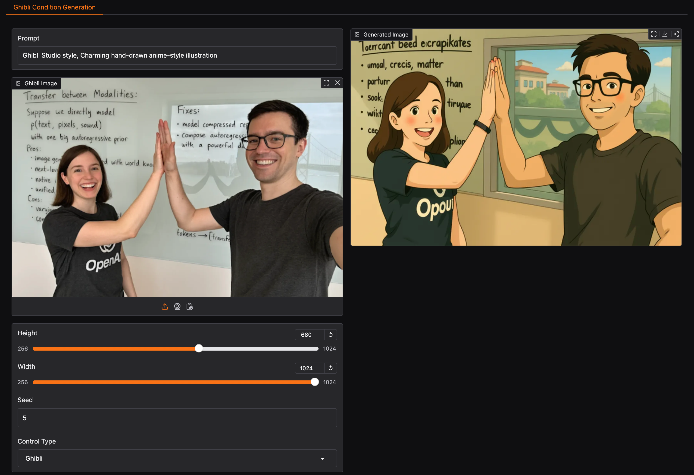
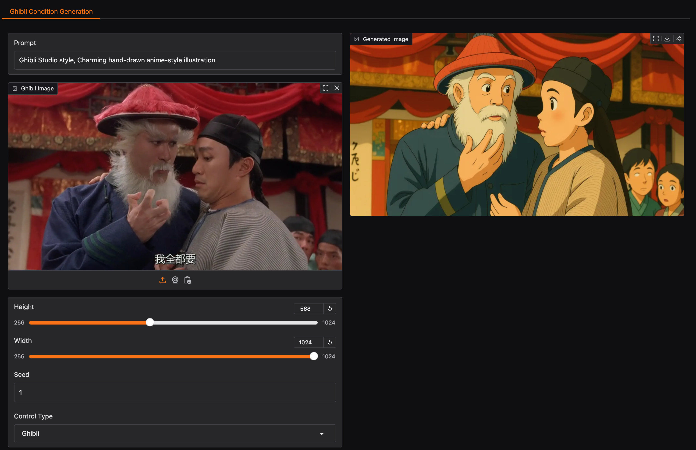

# Implementation of EasyControl

EasyControl: Adding Efficient and Flexible Control for Diffusion Transformer

<a href='https://easycontrolproj.github.io/'></a>
<a href='https://arxiv.org/pdf/2503.07027'></a> 
<a href="https://huggingface.co/Xiaojiu-Z/EasyControl/"></a>
<a href='https://huggingface.co/spaces/jamesliu1217/EasyControl'></a>
<a href='https://huggingface.co/spaces/jamesliu1217/EasyControl_Ghibli'></a>

> *[Yuxuan Zhang](https://xiaojiu-z.github.io/YuxuanZhang.github.io/), [Yirui Yuan](https://github.com/Reynoldyy), [Yiren Song](https://scholar.google.com.hk/citations?user=L2YS0jgAAAAJ), [Haofan Wang](https://haofanwang.github.io/), [Jiaming Liu](https://scholar.google.com/citations?user=SmL7oMQAAAAJ&hl=en)*
> <br>
> Tiamat AI, ShanghaiTech University, National University of Singapore, Liblib AI


## Features
* **Motivation:** The architecture of diffusion models is transitioning from Unet-based to DiT (Diffusion Transformer). However, the DiT ecosystem lacks mature plugin support and faces challenges such as efficiency bottlenecks, conflicts in multi-condition coordination, and insufficient model adaptability.
* **Contribution:** We propose EasyControl, an efficient and flexible unified conditional DiT framework. By incorporating a lightweight Condition Injection LoRA module, a Position-Aware Training Paradigm, and a combination of Causal Attention mechanisms with KV Cache technology, we significantly enhance **model compatibility** (enabling plug-and-play functionality and style lossless control), **generation flexibility** (supporting multiple resolutions, aspect ratios, and multi-condition combinations), and **inference efficiency**.


## News
- **2025-04-11**: 🔥🔥🔥 Training code have been released. Recommanded Hardware: at least 1x NVIDIA H100/H800/A100, GPUs Memory: ~80GB GPU memory.
- **2025-04-09**: ⭐️ The codes for the simple API have been released. If you wish to run the models on your personal machines, head over to the simple_api branch to access the relevant resources.

- **2025-04-07**: 🔥 Thanks to the great work by [CFG-Zero*](https://github.com/WeichenFan/CFG-Zero-star) team, EasyControl is now integrated with CFG-Zero*!! With just a few lines of code, you can boost image fidelity and controllability!! You can download the modified code from [this link](https://github.com/WeichenFan/CFG-Zero-star/blob/main/models/easycontrol/infer.py) and try it.

<table class="center">
  <tr>
    <td></td>
    <td></td>
    <td></td>
  </tr>
  <tr>
    <td align="center"><b>Source Image</b></td>
    <td align="center"><b>CFG</b></td>
    <td align="center"><b>CFG-Zero*</b></td>
  </tr>
</table>

- **2025-04-03**: Thanks to [jax-explorer](https://github.com/jax-explorer), [Ghibli Img2Img Control ComfyUI Node](https://github.com/jax-explorer/ComfyUI-easycontrol) is supported!

- **2025-04-01**: 🔥 New [Stylized Img2Img Control Model](https://huggingface.co/spaces/jamesliu1217/EasyControl_Ghibli) is now released!! Transform portraits into Studio Ghibli-style artwork using this LoRA model. Trained on **only 100 real Asian faces** paired with **GPT-4o-generated Ghibli-style counterparts**, it preserves facial features while applying the iconic anime aesthetic.

<div align="center">
<table>
<tr>
    <td></td>
    <td></td>
</tr>
<tr>
    <td align="center">Example 3</td>
    <td align="center">Example 4</td>
</tr>
</table>
</div>

- **2025-03-19**: 🔥 We have released [huggingface demo](https://huggingface.co/spaces/jamesliu1217/EasyControl)! You can now try out EasyControl with the huggingface space, enjoy it!
<div align="center">
<table>
<tr>
    <td></td>
    <td></td>
</tr>
<tr>
    <td align="center">Example 1</td>
    <td align="center">Example 2</td>
</tr>
</table>
</div>

- **2025-03-18**: 🔥 We have released our [pre-trained checkpoints](https://huggingface.co/Xiaojiu-Z/EasyControl/) on Hugging Face! You can now try out EasyControl with the official weights. 
- **2025-03-12**: ⭐️ Inference code are released. Once we have ensured that everything is functioning correctly, the new model will be merged into this repository. Stay tuned for updates! 😊

## Installation

We recommend using Python 3.10 and PyTorch with CUDA support. To set up the environment:

```bash
# Create a new conda environment
conda create -n easycontrol python=3.10
conda activate easycontrol

# Install other dependencies
pip install -r requirements.txt
```

## Download

You can download the model directly from [Hugging Face](https://huggingface.co/EasyControl/EasyControl).
Or download using Python script:

```python
from huggingface_hub import hf_hub_download
hf_hub_download(repo_id="Xiaojiu-Z/EasyControl", filename="models/canny.safetensors", local_dir="./")
hf_hub_download(repo_id="Xiaojiu-Z/EasyControl", filename="models/depth.safetensors", local_dir="./")
hf_hub_download(repo_id="Xiaojiu-Z/EasyControl", filename="models/hedsketch.safetensors", local_dir="./")
hf_hub_download(repo_id="Xiaojiu-Z/EasyControl", filename="models/inpainting.safetensors", local_dir="./")
hf_hub_download(repo_id="Xiaojiu-Z/EasyControl", filename="models/pose.safetensors", local_dir="./")
hf_hub_download(repo_id="Xiaojiu-Z/EasyControl", filename="models/seg.safetensors", local_dir="./")
hf_hub_download(repo_id="Xiaojiu-Z/EasyControl", filename="models/subject.safetensors", local_dir="./")
hf_hub_download(repo_id="Xiaojiu-Z/EasyControl", filename="models/Ghibli.safetensors", local_dir="./")
```

If you cannot access Hugging Face, you can use [hf-mirror](https://hf-mirror.com/) to download the models:
```python
export HF_ENDPOINT=https://hf-mirror.com
huggingface-cli download --resume-download Xiaojiu-Z/EasyControl --local-dir checkpoints --local-dir-use-symlinks False
```

## Usage
Here's a basic example of using EasyControl:

### Model Initialization

```python
import torch
from PIL import Image
from src.pipeline import FluxPipeline
from src.transformer_flux import FluxTransformer2DModel
from src.lora_helper import set_single_lora, set_multi_lora

def clear_cache(transformer):
    for name, attn_processor in transformer.attn_processors.items():
        attn_processor.bank_kv.clear()

# Initialize model
device = "cuda"
base_path = "FLUX.1-dev"  # Path to your base model
pipe = FluxPipeline.from_pretrained(base_path, torch_dtype=torch.bfloat16, device=device)
transformer = FluxTransformer2DModel.from_pretrained(
    base_path, 
    subfolder="transformer",
    torch_dtype=torch.bfloat16, 
    device=device
)
pipe.transformer = transformer
pipe.to(device)

# Load control models
lora_path = "./checkpoints/models"
control_models = {
    "canny": f"{lora_path}/canny.safetensors",
    "depth": f"{lora_path}/depth.safetensors",
    "hedsketch": f"{lora_path}/hedsketch.safetensors",
    "pose": f"{lora_path}/pose.safetensors",
    "seg": f"{lora_path}/seg.safetensors",
    "inpainting": f"{lora_path}/inpainting.safetensors",
    "subject": f"{lora_path}/subject.safetensors",
}
```

### Single Condition Control

```python
# Single spatial condition control example
path = control_models["canny"]
set_single_lora(pipe.transformer, path, lora_weights=[1], cond_size=512)

# Generate image
prompt = "A nice car on the beach"
spatial_image = Image.open("./test_imgs/canny.png").convert("RGB")

image = pipe(
    prompt,
    height=720,
    width=992,
    guidance_scale=3.5,
    num_inference_steps=25,
    max_sequence_length=512,
    generator=torch.Generator("cpu").manual_seed(5),
    spatial_images=[spatial_image],
    cond_size=512,
).images[0]

# Clear cache after generation
clear_cache(pipe.transformer)
```

<div align="center">
<table>
<tr>
    <td></td>
    <td></td>
</tr>
<tr>
    <td align="center">Canny Condition</td>
    <td align="center">Generated Result</td>
</tr>
</table>
</div>

```python
# Single subject condition control example
path = control_models["subject"]
set_single_lora(pipe.transformer, path, lora_weights=[1], cond_size=512)

# Generate image
prompt = "A SKS in the library"
subject_image = Image.open("./test_imgs/subject_0.png").convert("RGB")

image = pipe(
    prompt,
    height=1024,
    width=1024,
    guidance_scale=3.5,
    num_inference_steps=25,
    max_sequence_length=512,
    generator=torch.Generator("cpu").manual_seed(5),
    subject_images=[subject_image],
    cond_size=512,
).images[0]

# Clear cache after generation
clear_cache(pipe.transformer)
```

<div align="center">
<table>
<tr>
    <td></td>
    <td></td>
</tr>
<tr>
    <td align="center">Subject Condition</td>
    <td align="center">Generated Result</td>
</tr>
</table>
</div>

### Multi-Condition Control

```python
# Multi-condition control example
paths = [control_models["subject"], control_models["inpainting"]]
set_multi_lora(pipe.transformer, paths, lora_weights=[[1], [1]], cond_size=512)

prompt = "A SKS on the car"
subject_images = [Image.open("./test_imgs/subject_1.png").convert("RGB")]
spatial_images = [Image.open("./test_imgs/inpainting.png").convert("RGB")]

image = pipe(
    prompt,
    height=1024,
    width=1024,
    guidance_scale=3.5,
    num_inference_steps=25,
    max_sequence_length=512,
    generator=torch.Generator("cpu").manual_seed(42),
    subject_images=subject_images,
    spatial_images=spatial_images,
    cond_size=512,
).images[0]

# Clear cache after generation
clear_cache(pipe.transformer)
```

<div align="center">
<table>
<tr>
    <td></td>
    <td></td>
    <td></td>
</tr>
<tr>
    <td align="center">Subject Condition</td>
    <td align="center">Inpainting Condition</td>
    <td align="center">Generated Result</td>
</tr>
</table>
</div>

### Ghibli-Style Portrait Generation

```python
import spaces
import os
import json
import time
import torch
from PIL import Image
from tqdm import tqdm
import gradio as gr

from safetensors.torch import save_file
from src.pipeline import FluxPipeline
from src.transformer_flux import FluxTransformer2DModel
from src.lora_helper import set_single_lora, set_multi_lora, unset_lora

# Initialize the image processor
base_path = "black-forest-labs/FLUX.1-dev"    
lora_base_path = "./checkpoints/models"


pipe = FluxPipeline.from_pretrained(base_path, torch_dtype=torch.bfloat16)
transformer = FluxTransformer2DModel.from_pretrained(base_path, subfolder="transformer", torch_dtype=torch.bfloat16)
pipe.transformer = transformer
pipe.to("cuda")

def clear_cache(transformer):
    for name, attn_processor in transformer.attn_processors.items():
        attn_processor.bank_kv.clear()

# Define the Gradio interface
@spaces.GPU()
def single_condition_generate_image(prompt, spatial_img, height, width, seed, control_type):
    # Set the control type
    if control_type == "Ghibli":
        lora_path = os.path.join(lora_base_path, "Ghibli.safetensors")
    set_single_lora(pipe.transformer, lora_path, lora_weights=[1], cond_size=512)
    
    # Process the image
    spatial_imgs = [spatial_img] if spatial_img else []
    image = pipe(
        prompt,
        height=int(height),
        width=int(width),
        guidance_scale=3.5,
        num_inference_steps=25,
        max_sequence_length=512,
        generator=torch.Generator("cpu").manual_seed(seed), 
        subject_images=[],
        spatial_images=spatial_imgs,
        cond_size=512,
    ).images[0]
    clear_cache(pipe.transformer)
    return image

# Define the Gradio interface components
control_types = ["Ghibli"]


# Create the Gradio Blocks interface
with gr.Blocks() as demo:
    gr.Markdown("# Ghibli Studio Control Image Generation with EasyControl")
    gr.Markdown("The model is trained on **only 100 real Asian faces** paired with **GPT-4o-generated Ghibli-style counterparts**, and it preserves facial features while applying the iconic anime aesthetic.")
    gr.Markdown("Generate images using EasyControl with Ghibli control LoRAs.（Due to hardware constraints, only low-resolution images can be generated. For high-resolution (1024+), please set up your own environment.）")
    
    gr.Markdown("**[Attention!!]**：The recommended prompts for using Ghibli Control LoRA should include the trigger words: `Ghibli Studio style, Charming hand-drawn anime-style illustration`")
    gr.Markdown("😊😊If you like this demo, please give us a star (github: [EasyControl](https://github.com/Xiaojiu-z/EasyControl))")

    with gr.Tab("Ghibli Condition Generation"):
        with gr.Row():
            with gr.Column():
                prompt = gr.Textbox(label="Prompt", value="Ghibli Studio style, Charming hand-drawn anime-style illustration")
                spatial_img = gr.Image(label="Ghibli Image", type="pil")  # 上传图像文件
                height = gr.Slider(minimum=256, maximum=1024, step=64, label="Height", value=768)
                width = gr.Slider(minimum=256, maximum=1024, step=64, label="Width", value=768)
                seed = gr.Number(label="Seed", value=42)
                control_type = gr.Dropdown(choices=control_types, label="Control Type")
                single_generate_btn = gr.Button("Generate Image")
            with gr.Column():
                single_output_image = gr.Image(label="Generated Image")


    # Link the buttons to the functions
    single_generate_btn.click(
        single_condition_generate_image,
        inputs=[prompt, spatial_img, height, width, seed, control_type],
        outputs=single_output_image
    )

# Launch the Gradio app
demo.queue().launch()
```

<div align="center">
<table>
<tr>
    <td></td>
    <td></td>
</tr>
<tr>
    <td align="center">Input Image</td>
    <td align="center">Generated Result</td>
</tr>
</table>
</div>

## Usage Tips

- Clear cache after each generation using `clear_cache(pipe.transformer)`
- For optimal performance:
  - Start with `guidance_scale=3.5` and adjust based on results
  - Use `num_inference_steps=25` for a good balance of quality and speed
- When using set_multi_lora api, make sure the subject lora path(subject) is before the spatial lora path(canny, depth, hedsketch, etc.).

## Todo List
1. - [x] Inference code 
2. - [x] Spatial Pre-trained weights 
3. - [x] Subject Pre-trained weights 
4. - [x] Training code


## Star History

[](https://star-history.com/#Xiaojiu-z/EasyControl&Date)

## Disclaimer
The code of EasyControl is released under [Apache License](https://github.com/Xiaojiu-Z/EasyControl?tab=Apache-2.0-1-ov-file#readme) for both academic and commercial usage. Our released checkpoints are for research purposes only. Users are granted the freedom to create images using this tool, but they are obligated to comply with local laws and utilize it responsibly. The developers will not assume any responsibility for potential misuse by users.

## Hiring/Cooperation
- **2025-04-03**: If you are interested in EasyControl and beyond, or if you are interested in building 4o-like capacity (in a low-budget way, of course), we can collaborate offline in Shanghai/Beijing/Hong Kong/Singapore or online.
Reach out: **jmliu1217@gmail.com (wechat: jiaming068870)**

## Citation
```bibtex
@article{zhang2025easycontrol,
  title={EasyControl: Adding Efficient and Flexible Control for Diffusion Transformer},
  author={Zhang, Yuxuan and Yuan, Yirui and Song, Yiren and Wang, Haofan and Liu, Jiaming},
  journal={arXiv preprint arXiv:2503.07027},
  year={2025}
}
```
